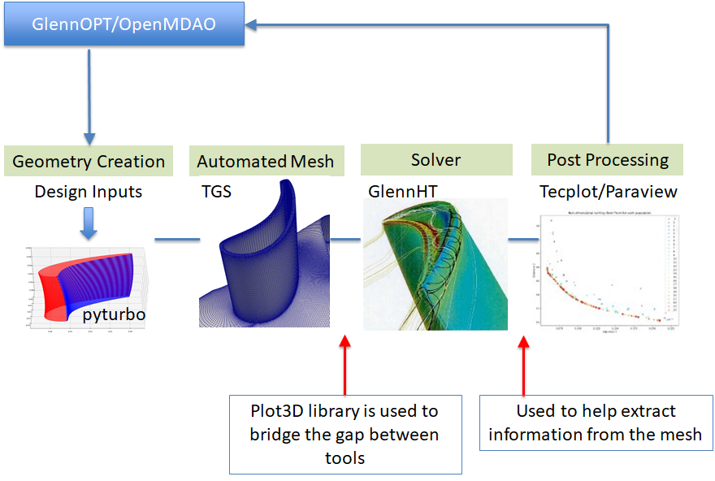

# Plot3D
A python and julia plot3D library for reading, writing, finding connectivity, and post processing for Plot3D data format.
This library is intended for public release on pip. Currently the project's release is in approval process.

## Documentation
Auto documentation can be generated by gitlab pages see here https://www.youtube.com/watch?v=kvZ9teaA5zI 
We need actual runners enabled to do this. Contacting Herb and Calvin for more info on how to get this. I dont know. 

> [Link to documentation](https://lte-turbo.gitlab.grc.nasa.gov/cad/plot3d-utilities/)
