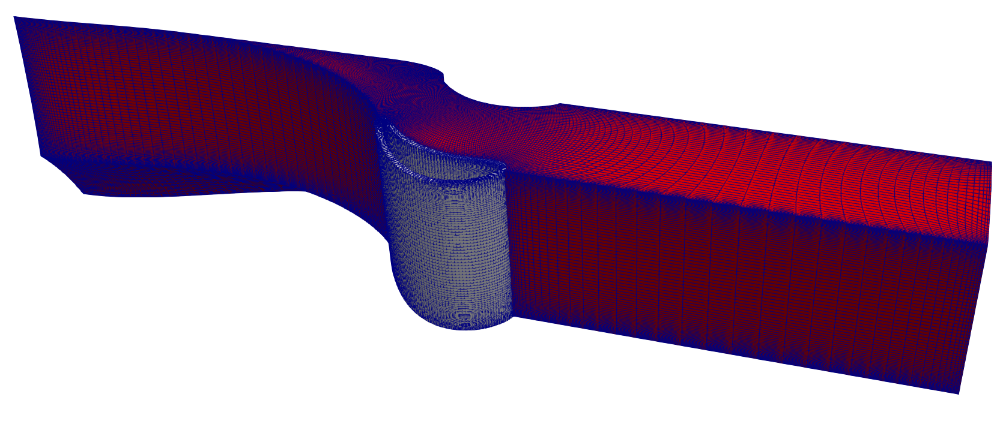
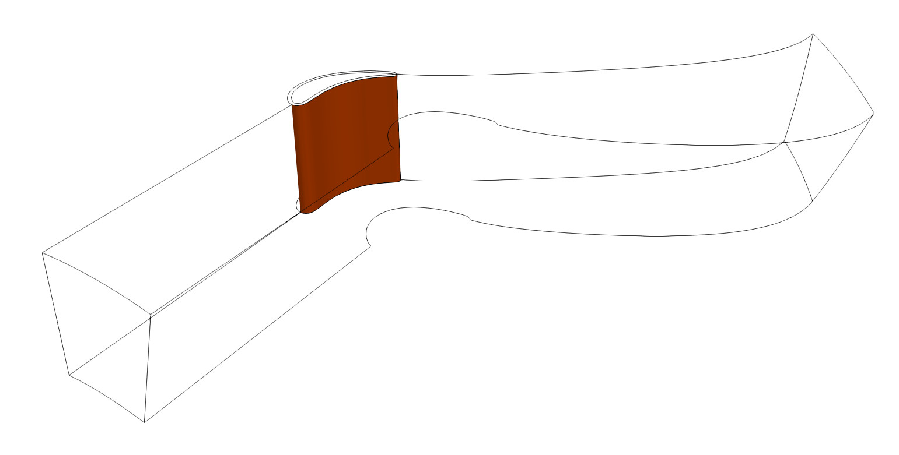
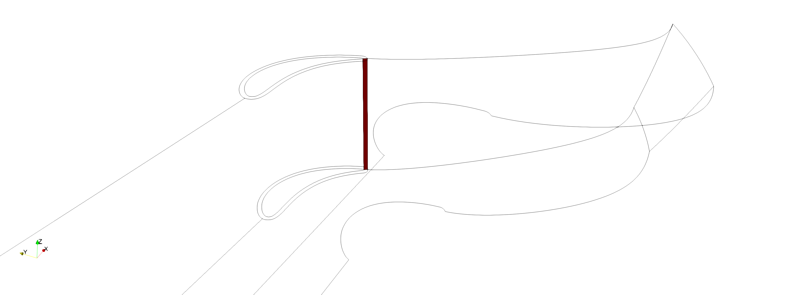
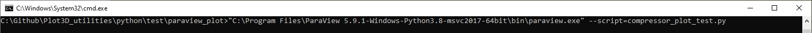
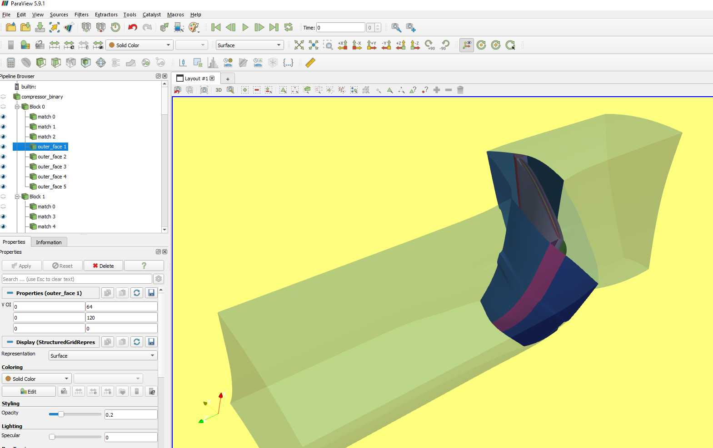

Block to Block Connectivity
=============================

Computational Grids are often divided into blocks for easier gridding. It is important to know how these blocks connect with each other in order to model the transfer of information. Computational Fluid Dynamics (CFD) requires the solver to know the "connectivity" of these blocks. 

The plot3D python library has a function for determining the connectivity. This is found by taking the combination of each block with another block and scanning the nodes on the exterior faces of block 1 with the exterior face of block 2. If there is a match then the two faces are connected. The code can search for *full face matches* or *partial matching*. *Full face matching* is much faster and should be used if your grid has a definite match. 

Below is an example of a turbine domain with two blocks: HGrid in (red) and ogrid in (white). The two share a connected face with partial matching. There's also the o-mesh which within itself has a connected face. 

To find connectivity simply call the function *connectivity* and pass in the blocks. This will return two things: face_matches and outer faces. Face matches are faces that are connected between the blocks. Outer faces are the remaining outer faces that aren't connected to anything. This can take a long time to run for larger meshes. 

.. code-block:: python
    :linenos:

    blocks = read_plot3D('PahtCascade.xyz', binary = True, big_endian=True)
    # Block 1 is the blade O-Mesh k=0
    # outer_faces, _ = get_outer_faces(blocks[0]) # lets check
    face_matches, outer_faces_formatted = connectivity(blocks)

This is an example of the output. The figure below shows the block 1 and 2 matching faces found in the variable *face_matches*.

This is the matching face within the omesh 

Face Orientation: Cross-Plane Connectivity
*********************************************

When two connected faces share the **same constant axis** (e.g., both K-constant), the two varying axes are identical and only 4 direction combinations exist. These are fully encodable by the ``lb/ub`` diagonal convention.

When faces lie on **different constant planes** (e.g., a K-face connects to a J-face), the varying axes differ. Face A varies in (i, j) while Face B varies in (i, k). This introduces an additional degree of freedom — which axis maps to which:

- **No swap**: A(i,j) maps to B(i,k) — 4 direction combos (encodable by lb/ub)
- **Swapped**: A(i,j) maps to B(k,i) — 4 direction combos (need orientation)

**4 × 2 = 8 total permutations. lb/ub only encodes 4.**

The ``orientation`` vector solves this. It is computed by ``_compute_orientation()`` in ``connectivity.py`` and maps each face1 axis to a face2 axis:

.. code-block:: python

    # orientation = [d1_maps_to, d2_maps_to, d3_maps_to]
    # 1-indexed: 1=I, 2=J, 3=K
    #
    # Example: orientation = [2, 1, 3]
    #   face1 I-axis -> face2 J-axis
    #   face1 J-axis -> face2 I-axis
    #   face1 K-axis -> face2 K-axis

Direction (forward/reverse) is encoded in the ``lb/ub`` values, not in the orientation vector. The ``verify.py`` module's ``_generate_permutations()`` tests all 8 combinations (4 direct + 4 transposed) to confirm the match.

For a detailed analysis with diagrams, see the `Root Cause Analysis <https://github.com/nasa/Plot3D_utilities/blob/main/docs/notes/unverified_connectivity_findings.md>`_ document.

**Rust version**: The `plot3d-rs <https://github.com/pjuangph/plot3d-rs>`_ crate mirrors this logic but stores orientation as flags: ``Orientation { swapped, u_reversed, v_reversed }``. Both representations encode the same 8 permutations.

The ``u`` and ``v`` names are abstract — they map to concrete i/j/k axes depending on which axis is constant:

.. list-table:: u/v to axis mapping
   :header-rows: 1
   :widths: 30 35 35

   * - Constant axis
     - u (outer loop)
     - v (inner loop)
   * - I-constant
     - j
     - k
   * - J-constant
     - i
     - k
   * - K-constant
     - i
     - j

So ``u_reversed: true`` means the outer-loop axis runs opposite direction on block2 vs block1, and ``v_reversed: true`` means the inner-loop axis runs opposite.

Plotting Connectivity using Paraview
****************************************
This example shows how you can take a mesh created Numeca Autogrid and plot the connecitivity using paraview. With this information, anyone should be able to comprehend the format and export it to whatever solver. 
This code has been tested using paraview 5.9. Modifications may need to be added for Paraview 5.10

.. note::

    Important Note: This is a 2 step process because: Paraview has it's own python environment called pvpython which it uses to automate plotting. 
    You do not have full access to this library, so pip installs won't work. This means you cannot directly call the plot3d library from paraview. 
    
    We need to split this into 2 codes. 
    
    **Part 1** One code runs on python from your own environment. 
    
    **Part 2** the other code runs from paraview's python environment. 

Part 1 - Processing the data locally for paraview import 
--------------------------------------------------------------
The goal if this code is to create a pickle file that is read in part 2. This pickle file contains the matching faces and outer faces. 

.. literalinclude:: ../_static/paraview_code_part1.py
  :language: python

Part 2 - Calling Paraview in script mode 
---------------------------------------------------------
This part of the code shows how you can read the pickle file in part 1 from within paraview to display all your plots.

This code was tested with Paraview version 5.9 https://www.paraview.org/download/ 

Paraview executable can be called with the script option to have it automatically create the plots for you. 

For windows this looks like this. You have the `[working folder]>"[path to paraview executable]" --script=[your_python_script.py]`

.. note::
    Has been tested on Paraview 5.10. Not backwards compatible with older paraview versions 

    C:\\Github\\Plot3D_utilities\\python\\test\\paraview_plot > "C:\\Program Files\\ParaView 5.10.0-Windows-Python3.9-msvc2017-AMD64\\bin\\paraview.exe" --script=compressor_plot_test.py

.. literalinclude:: ../_static/paraview_code_part2.py
  :language: python

This is the contents of pv_library.py

.. literalinclude:: ../_static/paraview_code_part3.py
  :language: python

The output should look like the following 

