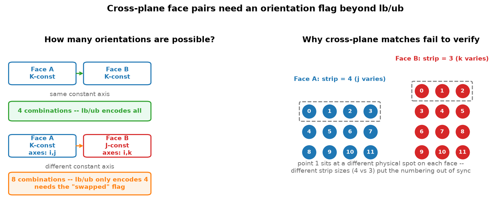

# Unverified Connectivity Faces: Root Cause Analysis

---

## 1. The Problem

The Rust connectivity finder (`plot3d-rs`) categorizes face matches into three groups:

| Category | Count | Status |
|----------|------:|--------|
| `connectivity_face_matches` | 14,389 | Verified point-by-point |
| `connectivity_unverified` | 10,469 | Geometrically matched but failed directed verification |
| `non_connected_faces` | 1,886 | No match found (boundary faces) |

**The 10,469 unverified faces look correct in plots** — the faces visually overlap.
So why does the Rust verifier reject them?

---

## 2. How Directed Traversal Works

The GlennHT solver needs a **node-to-node mapping** between two connected faces.
This is encoded with diagonal corners `lb` (lower-bound) and `ub` (upper-bound):

```
Face on block A:  lb=[0, 0, 0]  ub=[24, 408, 0]    (K-constant, k=0)
Face on block B:  lb=[408, 0, 0]  ub=[0, 0, 24]     (J-constant, j=0)
```

The verification extracts points by walking from `lb` to `ub`:

```python
for i in range(lb[0] → ub[0]):      # outer loop
    for j in range(lb[1] → ub[1]):   # middle loop
        for k in range(lb[2] → ub[2]):   # inner loop
            point = block[i, j, k]
```

**Point N from face A must equal point N from face B.**
If they don't match, the solver maps data to the wrong grid points.

---

## 3. Diagonal Combinatorics: 2D vs 3D

### 2D case: 4 diagonals

A face on a structured grid is a 2D surface with two varying axes. The `lb/ub`
convention encodes the start and end corners — the diagonal. For two axes (i, j),
each can go forward or backward:

| # | i direction | j direction | lb → ub |
|---|-------------|-------------|---------|
| 1 | forward | forward | `lb=[0,0]` → `ub=[3,4]` |
| 2 | backward | backward | `lb=[3,4]` → `ub=[0,0]` |
| 3 | forward | backward | `lb=[0,4]` → `ub=[3,0]` |
| 4 | backward | forward | `lb=[3,0]` → `ub=[0,4]` |

**2 axes × 2 directions = 4 combinations. All encodable by lb/ub.**

### 3D: same constant axis → still 4 combos

When both connected faces share the same constant axis (e.g., both K-constant),
the two varying axes are the same (both i and j). This is effectively the 2D
case — 4 direction combinations, all encodable by lb/ub.

**This is why 14,389 faces verify successfully.**

### 3D: different constant axes → 8 combos

When faces are on different constant planes (e.g., K-face ↔ J-face), the varying
axes differ. Face A varies in (i, j) while face B varies in (i, k). Now the
mapping between parametric axes has an additional degree of freedom — which axis
maps to which:

- **No swap**: A(i,j) maps to B(i,k) — 4 direction combos (encodable by lb/ub)
- **Swapped**: A(i,j) maps to B(k,i) — 4 direction combos (need `swapped` flag)

**4 × 2 = 8 total permutations. lb/ub only encodes 4.**

The `swapped` flag doubles the representable space from 4 to 8, covering all
possible axis mappings between cross-plane faces.

**This is why 10,469 faces fail verification — they need the swap.**



---

## 4. Investigation: First Unverified Entry

### The faces

```
Face1: block 0,   lb=[0, 0, 0]    ub=[24, 408, 0]
                   K-constant (k=0), varies in i(0→24) and j(0→408)
                   25 × 409 = 10,225 points

Face2: block 421,  lb=[408, 0, 0]  ub=[0, 0, 24]
                   J-constant (j=0), varies in i(408→0) and k(0→24)
                   409 × 25 = 10,225 points
```

Same number of points. Different constant axes.

### Test 1: Do the points overlap spatially?

Using nearest-neighbor search (scipy KDTree):

```
All 10,225 points match within 1e-13
Max distance: 1.01e-13
```

**The faces are geometrically identical.** Every point on face1 has an exact
counterpart on face2.

### Test 2: Does directed traversal match?

```
Standard lb→ub traversal: 25/10,225 match (0.2%)
Max distance: 1.21e-02
```

**Almost complete failure.** Only 25 points (one row) happen to align.

---

## 5. Root Cause: Loop Order Cannot Be Encoded in lb/ub

### What Face1's traversal produces

Face1 is K-constant, so the natural loop is `for i, for j`:

```
Point 0:    (i=0,  j=0)
Point 1:    (i=0,  j=1)
Point 2:    (i=0,  j=2)
...
Point 408:  (i=0,  j=408)
Point 409:  (i=1,  j=0)      ← outer loop increments
Point 410:  (i=1,  j=1)
...
```

Inner dimension = 409 (j varies fastest).

### What Face2's traversal produces

Face2 is J-constant, so the natural loop is `for i, for k`:

```
Point 0:    (i=408, k=0)
Point 1:    (i=408, k=1)
...
Point 24:   (i=408, k=24)
Point 25:   (i=407, k=0)     ← outer loop increments
Point 26:   (i=407, k=1)
...
```

Inner dimension = 25 (k varies fastest).

### The mismatch

Face1 produces strips of **409 points** (varying j).
Face2 produces strips of **25 points** (varying k).

Point 1 from face1 is at `(i=0, j=1)`.
Point 1 from face2 is at `(i=408, k=1)`.
These are **completely different physical locations**.

### What traversal order does face2 need?

Brute-forcing all 8 parametric permutations:

```
outer=i(0→408),   inner=k(0→24)    match=    1/10225
outer=i(0→408),   inner=k(24→0)    match=    1/10225
outer=i(408→0),   inner=k(0→24)    match=   25/10225
outer=i(408→0),   inner=k(24→0)    match=    1/10225
outer=k(0→24),    inner=i(0→408)   match=   25/10225
outer=k(0→24),    inner=i(408→0)   match=10225/10225  *** PASS ***
outer=k(24→0),    inner=i(0→408)   match=    1/10225
outer=k(24→0),    inner=i(408→0)   match=  409/10225
```

**The correct order is: `k` as outer loop, `i` as inner loop (reversed).**

This means:
- Face1's i-axis (25 values) maps to face2's k-axis (25 values)
- Face1's j-axis (409 values) maps to face2's i-axis (409 values, reversed)

---

## 6. Why lb/ub Cannot Express This

The `lb` and `ub` arrays have 6 values total (3 each). For a face:

- 2 values are locked (constant axis: `lb[ax] == ub[ax]`)
- 4 remaining values encode **start** and **end** for the two varying axes

These 4 values can encode:
- **Direction** per axis: `lb[i] > ub[i]` means traverse in reverse

These 4 values **cannot** encode:
- **Loop order**: which axis is outer vs inner

```
lb/ub can encode:     i(408→0), k(0→24)    [direction per axis]
lb/ub cannot encode:  k is outer, i is inner [loop nesting order]
```

The natural loop order for a J-constant face is always `for i, for k` (lower
index axis = outer). There is no lb/ub value that makes `k` the outer loop.

### What the Rust code does

`align_face_orientations()` in plot3d-rs tries all 8 permutations of the
**parametric** (u, v) space:

| Permutation | u_reversed | v_reversed | swapped |
|:-----------:|:----------:|:----------:|:-------:|
| 1 | false | false | false |
| 2 | true  | false | false |
| 3 | false | true  | false |
| 4 | true  | true  | false |
| 5 | false | false | true  |
| 6 | true  | false | true  |
| 7 | false | true  | true  |
| 8 | true  | true  | true  |

The `swapped` flag swaps the u and v parametric axes. **This is exactly the
missing piece** — it encodes whether the loop order should be reversed.

### What u and v mean for each face type

The `u` and `v` names are abstract — they map to concrete i/j/k axes depending
on which axis is constant:

| Constant axis | u (outer loop) | v (inner loop) |
|:---:|:---:|:---:|
| I-constant | j | k |
| J-constant | i | k |
| K-constant | i | j |

So in the JSON output:
- `u_reversed: true` → the outer-loop axis runs opposite direction on block2 vs block1
- `v_reversed: true` → the inner-loop axis runs opposite direction on block2 vs block1
- `swapped: true` → block2's u and v are transposed (e.g., block1 has u=i,v=k but block2 has u=k,v=i)

But this orientation data is **not written to connectivity.json**. The
`face_match_to_json()` function only outputs `block1` and `block2`:

```rust
// BEFORE (drops orientation)
fn face_match_to_json(fm: &FaceMatch) -> Value {
    json!({
        "block1": face_record_to_json(&fm.block1),
        "block2": face_record_to_json(&fm.block2),
    })
}
```

---

## 7. The Solution

### Part A: Output orientation in connectivity.json (Rust fix)

```rust
// AFTER (includes orientation)
fn face_match_to_json(fm: &FaceMatch) -> Value {
    let mut v = json!({
        "block1": face_record_to_json(&fm.block1),
        "block2": face_record_to_json(&fm.block2),
    });
    if let Some(ref orient) = fm.orientation {
        v["orientation"] = json!({
            "u_reversed": orient.u_reversed,
            "v_reversed": orient.v_reversed,
            "swapped": orient.swapped,
        });
    }
    v
}
```

The `Orientation` struct already has `#[derive(Serialize)]` and the `FaceMatch`
struct already stores `pub orientation: Option<Orientation>`. The data exists —
it was just being silently dropped during JSON serialization.

### Part B: Python verification tries all 8 permutations

When standard directed traversal fails, `verify_connectivity.py` now calls
`try_all_permutations()` which tests all 8 parametric orderings:

```python
def try_all_permutations(blk, lb, ub, pts_ref, tol):
    for swap in [False, True]:           # 2 axis orderings
        for o_rev in [False, True]:      # 2 outer directions
            for i_rev in [False, True]:  # 2 inner directions
                # Extract points with this permutation
                # Compare against reference points
                # Return best match + orientation flags
```

Results are reported in three categories:
- **Passed (direct)**: Standard lb→ub traversal matches
- **Passed (reoriented)**: A permutation matched — geometry correct, orientation needed
- **Failed**: No permutation matches — genuinely bad match

---

## 8. Summary

```
                    ┌─────────────────────────────┐
                    │  Two faces share the same    │
                    │  physical points in space     │
                    └──────────────┬──────────────┘
                                   │
                    ┌──────────────▼──────────────┐
                    │  Do they have the same       │
                    │  constant axis? (both K,     │
                    │  both J, or both I)          │
                    └──────┬───────────────┬──────┘
                           │               │
                         YES              NO
                           │               │
                    ┌──────▼──────┐ ┌──────▼──────────────┐
                    │ lb/ub can   │ │ lb/ub CANNOT encode  │
                    │ encode the  │ │ the loop order —     │
                    │ mapping via │ │ need orientation     │
                    │ direction   │ │ {swapped, u_reversed,│
                    │ flips only  │ │  v_reversed} flag    │
                    └─────────────┘ └──────────────────────┘
                           │               │
                    ┌──────▼──────┐ ┌──────▼──────────────┐
                    │ → verified  │ │ → unverified         │
                    │   (14,389)  │ │   (10,469)           │
                    └─────────────┘ └──────────────────────┘
```

The 10,469 unverified faces are **geometrically correct** connections between
blocks whose faces lie on **different constant planes** (e.g., K-face ↔ J-face).
The `lb/ub` diagonal convention can encode direction per axis but not loop
nesting order. The `swapped` orientation flag resolves this by telling the
reader which axis should be the outer vs inner loop.

---

## 9. Python Reference: NASA Plot3D_utilities

The Python version ([github.com/nasa/Plot3D_utilities](https://github.com/nasa/Plot3D_utilities))
already handles orientation correctly and served as the reference implementation.

### How Python handles it

**`connectivity.py`** — `_compute_orientation()` computes an axis mapping vector:

```python
orientation = [d1_maps_to, d2_maps_to, d3_maps_to]  # 1-indexed: 1=I, 2=J, 3=K
```

For example, `orientation = [2, 1, 3]` means face1's I-axis maps to face2's J-axis,
face1's J-axis maps to face2's I-axis, and K maps to K. Direction (forward/reverse)
is encoded in the lb/ub values, not in the orientation vector.

**`verify.py`** — `_generate_permutations()` tests all 8 combinations:
- 4 direct permutations (vary direction on two axes)
- 4 transposed permutations (swap which axis maps where)

This is the same 8-permutation approach used in the Rust code.

### Rust vs Python orientation representation

| | Python | Rust |
|---|--------|------|
| **Format** | `orientation = [2, 1, 3]` (axis mapping) | `Orientation { swapped, u_reversed, v_reversed }` (flags) |
| **Direction** | Stored in lb/ub | `u_reversed`, `v_reversed` |
| **Axis swap** | Implicit in mapping order | `swapped` flag |
| **Source** | [nasa/Plot3D_utilities](https://github.com/nasa/Plot3D_utilities) | [pjuangph/plot3d-rs](https://github.com/pjuangph/plot3d-rs) |

Both approaches encode the same 8 permutations — they just represent them differently.

---

## 10. Files Modified

| File | Change |
|------|--------|
| `fix_unverified_demo.py` | NEW — standalone demo script to debug the first unverified face |
| `connectivity_finder/src/main.rs` | Output `orientation` field in JSON |
| `verify_connectivity.py` | Added `try_all_permutations()` fallback, 3-category reporting |
