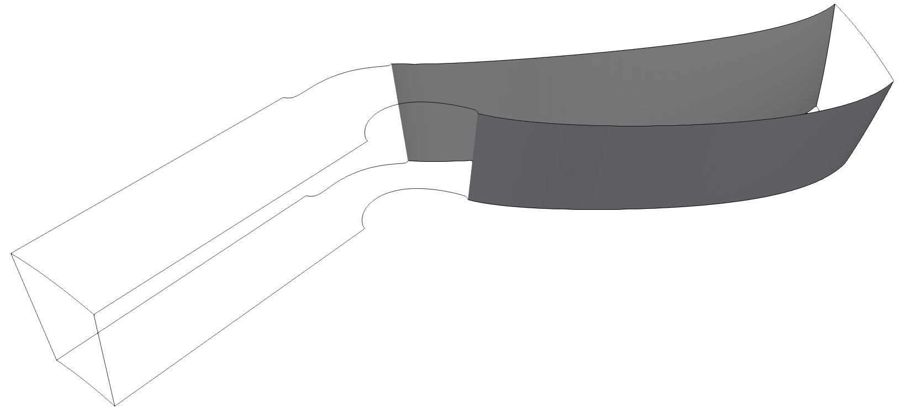

Periodicity
################
The domain above has a periodicity on the side walls and from block 1 to block 2 on the suction side. Plot3D library can find periodic surfaces. Periodic surfaces can only be found by rotation about the x-axis. The user also needs to specify which direction is periodic either *i*, *j*, or *k*. Combinations of outer faces are searched to find the ones that are periodic when rotated about the x-axis and in the "k" direction (default option). Below is an example on how to find periodic surfaces. 

In this example we will use the file  `PahtCascade-ASCII <https://nasa-public-data.s3.amazonaws.com/plot3d_utilities/PahtCascade-ASCII.xyz>`_

.. code-block:: python
    :linenos: 

    from plot3d import write_plot3D, read_plot3D, periodicity, connectivity

    blocks = read_plot3D('PahtCascade-ASCII.xyz', binary = False)
    face_matches, outer_faces_formatted = connectivity(blocks)
    periodic_surfaces, outer_faces_to_keep = periodicity(blocks,outer_faces,face_matches,periodic_direction='k',rotation_axis='x',nblades=55)
    # Append periodic surfaces to face_matches
    face_matches.extend(periodic_surfaces)

.. figure:: ../_static/turbine_domain-periodic-block1-2.png
    :width: 800px
    :align: center
    :alt: periodic surface from block 1 to block 2
    :figclass: align-center

.. figure:: ../_static/turbine_domain-periodic-block2-inlet.png
    :width: 800px
    :align: center
    :alt: periodic surface block 2 entrance of the domain
    :figclass: align-center

