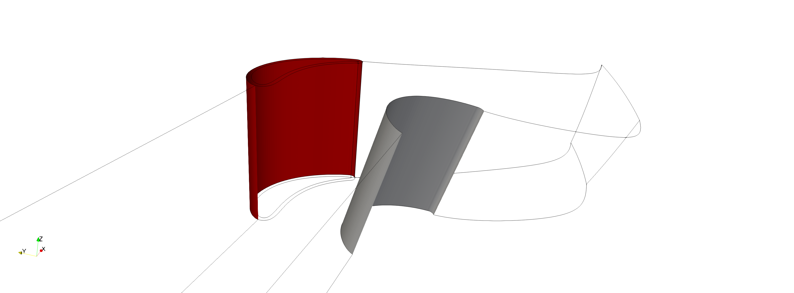
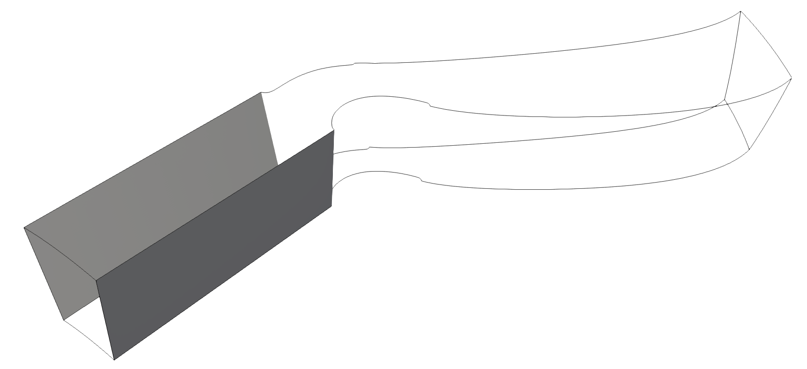
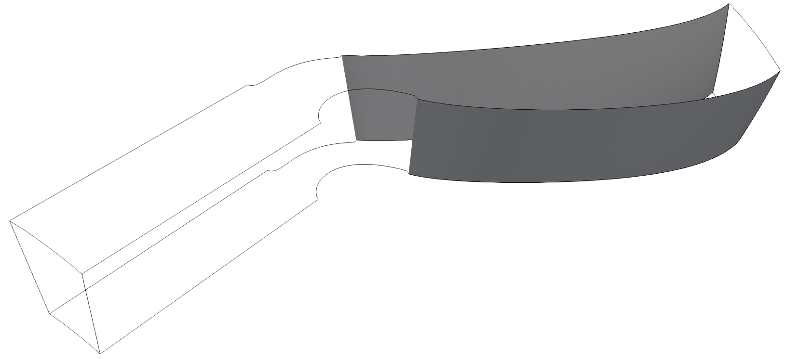

Periodicity
################
Periodicity is when you rotate a mesh sector about an axis and one side lines up with the other -- like a slice of pie that tiles into a full circle. Plot3D library can find periodic surfaces using ``rotated_periodicity``. It detects which outer faces match after rotation by a given angle about any axis (x, y, or z).

The function automatically:
  - Reduces the mesh by GCD for faster matching
  - Detects angular boundary faces to narrow the search space
  - Applies geometric pre-checks to reject non-matching pairs cheaply
  - Tries both +angle and -angle rotations for robustness

The matching algorithm has multiple phases:

**Phase 2** -- Main greedy loop with centroid precheck. Each unmatched face is tested against rotated candidates. Partial matches produce split faces that re-enter the pool. Runs until convergence with no iteration limit.

**Phase 3** -- Relaxed matching without centroid precheck. Uses 5x tolerance (5e-6) to catch wavy-surface faces rejected by the centroid filter. Also runs until convergence with **no iteration limit** (earlier versions had a hardcoded limit of 50 iterations which was insufficient for large meshes needing 100+ iterations).

You can optionally filter by ``periodic_direction`` ('i', 'j', or 'k') to only check faces on a constant index plane.

In this example we will use the file  `PahtCascade-ASCII <https://nasa-public-data.s3.amazonaws.com/plot3d_utilities/PahtCascade-ASCII.xyz>`_

.. code-block:: python
    :linenos:

    from plot3d import write_plot3D, read_plot3D, rotated_periodicity, connectivity_fast

    blocks = read_plot3D('PahtCascade-ASCII.xyz', binary = False)
    face_matches, outer_faces = connectivity_fast(blocks)
    periodic_surfaces, outer_faces_to_keep, periodic_faces, outer_faces = rotated_periodicity(
        blocks, face_matches, outer_faces,
        nblades=55, rotation_axis='x', periodic_direction='k')
    # Append periodic surfaces to face_matches
    face_matches.extend(periodic_surfaces)

